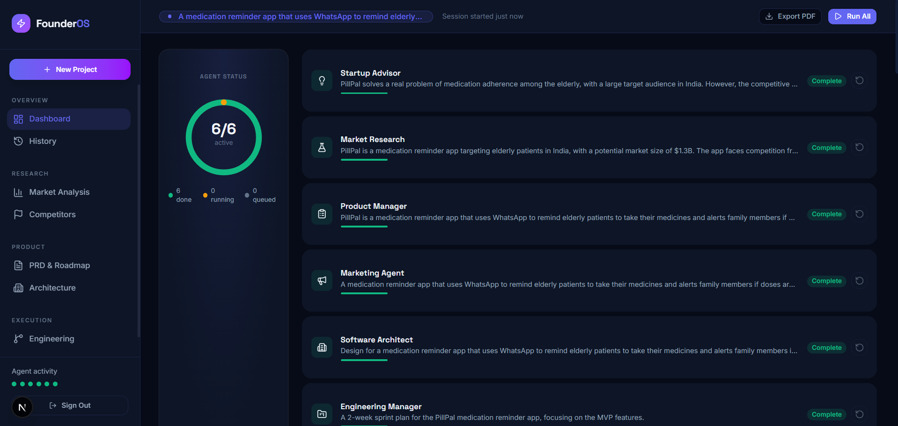
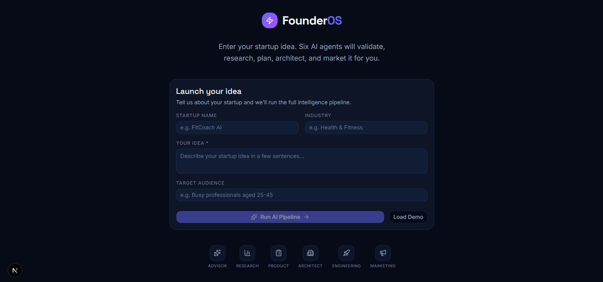
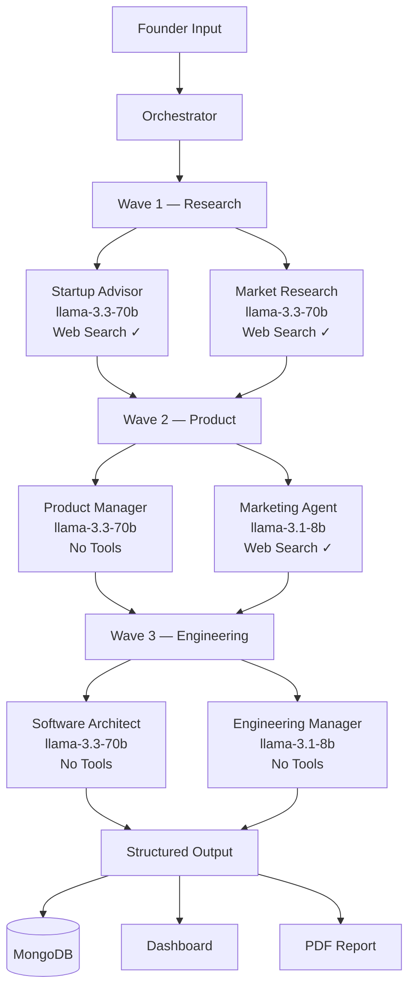
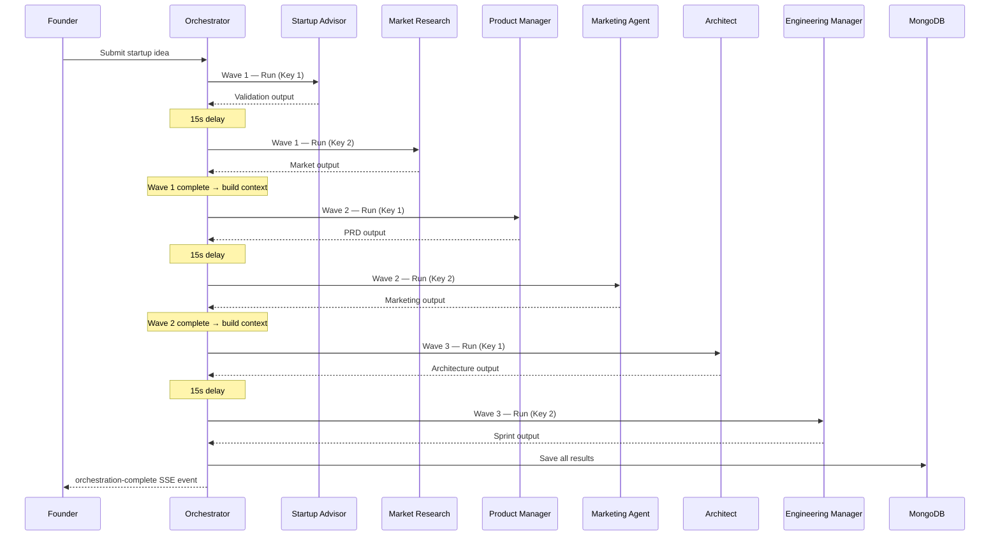
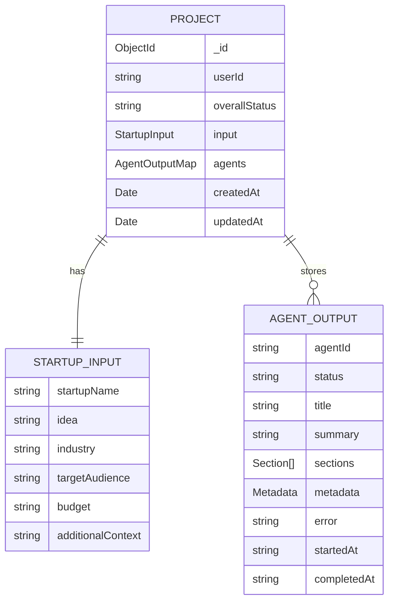
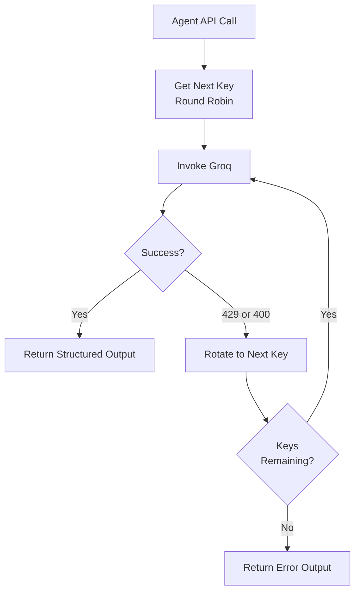

<div align="center">

# FounderOS

**Six AI agents. One startup idea. A complete business intelligence report in minutes.**

[What It Does](#what-it-does) • [Tech Stack](#tech-stack) • [Getting Started](#getting-started) • [Agent Architecture](#agent-architecture) • [API Reference](#api-reference) • [Data Flow](#data-flow) • [Contributing](#contributing)




</div>

---

## Table of Contents

- [What It Does](#what-it-does)
- [Live Demo](#live-demo)
- [Tech Stack](#tech-stack)
- [Project Structure](#project-structure)
- [Agent Architecture](#agent-architecture)
- [Wave Execution Model](#wave-execution-model)
- [Agent Configurations](#agent-configurations)
- [Data Flow](#data-flow)
- [Database Schema](#database-schema)
- [API Reference](#api-reference)
- [Environment Variables](#environment-variables)
- [Getting Started](#getting-started)
- [Key Design Decisions](#key-design-decisions)

---

## What It Does

A founder enters their startup idea — name, industry, idea description, and target audience. FounderOS spins up six specialized AI agents that work in coordinated waves, each building on the previous agent's output, producing a full business intelligence report.



**Output includes:**
- Idea validation with PMF score and risk assessment
- Market sizing (TAM / SAM / SOM) with competitor mapping
- Full PRD with user stories and 3-phase roadmap
- Landing page copy, LinkedIn post, and email campaigns
- Database schema, API contracts, and system architecture
- GitHub issues and 2-week sprint plan
- Downloadable PDF report of all findings

---

## Live Demo

Click **Load Demo** on the dashboard to run a simulated pipeline with pre-loaded FitCoach AI data — no API keys consumed.

---

## Tech Stack

| Layer | Technology | Purpose |
|---|---|---|
| Framework | Next.js 16 (App Router) | Full-stack React framework |
| Language | TypeScript | Type safety across the entire codebase |
| AI Agents | LangChain + LangGraph | Agent orchestration and ReAct loops |
| LLM Provider | Groq (Llama 3.3 70B / 3.1 8B) | Fast inference with structured output |
| Web Search | Tavily | Real-time web search for research agents |
| Database | MongoDB Atlas + Mongoose | Project persistence |
| State Management | Zustand + localStorage | Client-side global state with persistence |
| Styling | Tailwind CSS | Utility-first styling |
| Animation | Framer Motion | Agent status animations and transitions |
| Charts | Recharts | Market sizing and trend visualizations |
| PDF Export | React PDF (@react-pdf/renderer) | Downloadable report generation |
| Schema Validation | Zod | Agent output validation |

---

## Project Structure

```
founder_orchestra/
├── app/
│   ├── api/
│   │   ├── orchestrate/       # Main SSE pipeline endpoint
│   │   ├── projects/          # CRUD for saved projects
│   │   └── pdf/               # PDF generation endpoint
│   ├── dashboard/             # Main intelligence dashboard page
│   └── page.tsx               # Landing / idea input page
│
├── components/
│   └── dashboard/
│       ├── agent-orbit.tsx        # Animated agent status ring
│       ├── stats-row.tsx          # TAM / PMF / Competitors metrics
│       ├── market-sizing.tsx      # TAM/SAM/SOM bar chart
│       ├── trend-list.tsx         # Emerging trends with sparklines
│       ├── competitor-table.tsx   # Competitor comparison table
│       ├── user-stories.tsx       # Parsed user story cards
│       ├── product-roadmap.tsx    # 3-phase roadmap columns
│       ├── schema-grid.tsx        # DB schema table cards
│       ├── github-issues.tsx      # Issue cards with labels
│       ├── sprint-board.tsx       # Kanban sprint board
│       ├── marketing-assets.tsx   # Landing copy + LinkedIn post
│       └── dashboard-skeletons.tsx # Loading skeleton states
│
├── lib/
│   ├── agents/
│   │   ├── base-agent.ts      # Core agent runner (runAgent / runAgentWithTools)
│   │   ├── config.ts          # All 6 agent configurations + wave assignments
│   │   └── orchestrator.ts    # Wave coordinator
│   ├── db/
│   │   ├── mongodb.ts         # MongoDB connection
│   │   └── models/project.ts  # Mongoose project schema
│   ├── pdf/
│   │   └── report-template.tsx # React PDF document template
│   ├── store/
│   │   └── project-store.ts   # Zustand store + SSE event handler
│   ├── types/                 # Shared TypeScript types
│   ├── utils/                 # Rate limiting, helpers
│   └── validations/           # Zod request schemas
│
├── images/                    # README assets
├── .env.local                 # Local environment variables
└── .env.example               # Environment variable template
```

---

## Agent Architecture

Each agent is an independent unit with its own model, system prompt, wave assignment, tool access, and token budget. All agents share the same base runner in `base-agent.ts`.



### Agent Output Schema

Every agent returns the same structured shape, enforced by Zod and LangChain's `withStructuredOutput`:

```typescript
{
  title: string,
  summary: string,
  sections: [{
    heading: string,
    content: string,        // Markdown
    chartType?: "bar" | "pie" | "radar" | "line" | "area" | "funnel",
    data?: [{ name: string, value: number }],
    tableData?: { headers: string[], rows: string[][] }
  }],
  metadata: {
    viabilityScore?: string,
    riskLevel?: string,
    tam?: string,
    competitorCount?: string,
    trendCount?: string,
    totalIssues?: string,
    storyCount?: string,
    epicCount?: string,
    phaseCount?: string,
  }
}
```

---

## Wave Execution Model

Agents run in three sequential waves. Each wave waits for the previous to complete before starting. Within a wave, agents run sequentially with a 15-second delay between calls to respect Groq's RPM limits.



**Context chaining:** Each wave receives a concatenated summary of all previous agents' outputs as context, so downstream agents build on upstream findings rather than starting cold.

---

## Agent Configurations

| Agent | Model | Wave | Tools | Max Tokens | Primary Output |
|---|---|---|---|---|---|
| Startup Advisor | llama-3.3-70b-versatile | 1 | Web Search | 1500 | PMF validation, risk factors, next steps |
| Market Research | llama-3.3-70b-versatile | 1 | Web Search | 1500 | TAM/SAM/SOM, competitors, trends |
| Product Manager | llama-3.3-70b-versatile | 2 | None | 800 | PRD, user stories, roadmap |
| Marketing Agent | llama-3.1-8b-instant | 2 | Web Search | 800 | Landing copy, LinkedIn post, campaigns |
| Software Architect | llama-3.3-70b-versatile | 3 | None | 1500 | DB schema, API design, system architecture |
| Engineering Manager | llama-3.1-8b-instant | 3 | None | 800 | GitHub issues, sprint plan |

**Model routing rationale:** Heavy reasoning tasks (validation, market research, architecture) use the 70B model. Templated output tasks (marketing copy, sprint planning) use the 8B model which has 14× higher daily request limits on Groq's free tier.

---

## Data Flow

```mermaid
flowchart LR
    subgraph Client
        UI[Dashboard UI]
        ZS[Zustand Store]
        SSE[SSE Reader]
    end

    subgraph Server
        API[/api/orchestrate]
        ORC[Orchestrator]
        BA[base-agent.ts]
    end

    subgraph External
        GROQ[Groq API\nKey 1 / Key 2 / ...]
        TAV[Tavily Search]
        MDB[(MongoDB Atlas)]
    end

    UI -->|POST startup input| API
    API -->|Stream SSE events| SSE
    SSE -->|agent-start/complete/error| ZS
    ZS -->|re-render| UI
    API --> ORC
    ORC --> BA
    BA -->|withStructuredOutput| GROQ
    BA -->|web search| TAV
    ORC -->|save results| MDB
    MDB -->|load history| API
```

### SSE Event Types

The pipeline streams real-time events to the frontend via Server-Sent Events:

| Event | Payload | Effect |
|---|---|---|
| `project-created` | `projectId` | Sets project ID in store |
| `agent-start` | `agentId` | Sets agent status to "running" |
| `agent-progress` | `agentId`, `partialText` | Updates agent progress text |
| `agent-complete` | `agentId`, `output` | Populates agent output in store |
| `agent-error` | `agentId`, `error` | Sets agent status to "error" |
| `orchestration-complete` | `results`, `overallStatus` | Marks pipeline as done |
| `orchestration-error` | `error` | Resets pipeline status |

---

## Database Schema

Projects are persisted in MongoDB Atlas with the following Mongoose schema:



**`overallStatus`** values: `not-started` → `in-progress` → `completed` | `partial` | `error`

---

## API Reference

### `POST /api/orchestrate`

Triggers the full 6-agent pipeline. Returns a Server-Sent Events stream.

**Request body:**
```json
{
  "input": {
    "startupName": "DevPulse",
    "idea": "A GitHub-integrated dashboard...",
    "industry": "Developer Tools",
    "targetAudience": "Engineering managers at startups"
  },
  "projectId": "optional-existing-project-id"
}
```

**SSE stream response:** Series of `data: {...}\n\n` events (see SSE Event Types above).

---

### `GET /api/projects`

Returns all saved projects for the current user, sorted by most recent.

---

### `DELETE /api/projects?id=<projectId>`

Deletes a saved project by ID.

---

### `POST /api/pdf`

Generates and returns a PDF report for a given project's agent outputs.

---

## Environment Variables

Copy `.env.example` to `.env.local` and fill in the values:

```dotenv
# MongoDB
MONGODB_URI=mongodb+srv://<user>:<password>@cluster.mongodb.net/?appName=Cluster

# Groq API Keys — add as many as needed for round-robin key rotation
GROQ_API_KEY_1=gsk_...
GROQ_API_KEY_2=gsk_...
GROQ_API_KEY_3=gsk_...   # optional
GROQ_API_KEY_4=gsk_...   # optional

# Tavily Web Search (optional — agents fall back to internal knowledge if missing)
TAVILY_API_KEY=tvly-...

# NextAuth
NEXTAUTH_SECRET=your-random-secret
NEXTAUTH_URL=http://localhost:3000
```

**Groq key rotation:** The system automatically detects all `GROQ_API_KEY_*` environment variables and distributes API calls across them in round-robin order. Add more keys to increase your daily token budget (each free account has 100K tokens/day on the 70B model).

---

## Getting Started

### Prerequisites

- Node.js 18+
- MongoDB Atlas account (free tier works)
- Groq account — [console.groq.com](https://console.groq.com) (free)
- Tavily account — [app.tavily.com](https://app.tavily.com) (optional, free tier)

### Installation

```bash
# Clone the repo
git clone https://github.com/your-username/founder_orchestra.git
cd founder_orchestra

# Install dependencies
npm install

# Set up environment variables
cp .env.example .env.local
# Fill in your keys in .env.local

# Run the development server
npm run dev
```

Open [http://localhost:3000](http://localhost:3000).

### First Run

1. Enter your startup name and idea on the home page
2. Click **Run AI Pipeline**
3. Watch all 6 agents run in real time on the dashboard
4. Scroll through the intelligence sections as they populate
5. Click **Export PDF** to download the full report

---

## Key Design Decisions

### Why Groq?
Groq's inference speed (500–1000 tokens/second) means a full 6-agent pipeline completes in 2–4 minutes instead of 10–15 minutes on other providers. The free tier (1,000 requests/day on 70B, 14,400 on 8B) is sufficient for development and light production use.

### Why `withStructuredOutput` instead of JSON prompting?
Early versions prompted models to return JSON and parsed the response manually. This caused ZodErrors, wrong field names, and repetition loops. LangChain's `withStructuredOutput` enforces the Zod schema at the token generation level — the model physically cannot produce invalid field names.

### Why sequential execution within waves instead of parallel?
Groq's free tier has a 30 RPM limit on the 70B model. Running agents in parallel within a wave causes immediate 429 errors. Sequential execution with 15-second delays between agents keeps the pipeline within rate limits.

### Why Zustand with localStorage persistence?
The pipeline takes 2–4 minutes. If the user refreshes mid-run, localStorage persistence means their completed agent outputs survive the page reload. The store merges persisted state with current state on hydration.

### Why two model sizes?
The 70B model is used for tasks requiring deep reasoning (idea validation, market research, architecture design). The 8B model handles templated output tasks (marketing copy, sprint planning) where reasoning depth matters less. This gives 8B agents 14× higher daily request limits, reducing rate limit pressure on the pipeline.

---

## Rate Limit Strategy



Add `GROQ_API_KEY_3`, `GROQ_API_KEY_4` etc. to `.env.local` to expand the rotation pool — no code changes required.

---

## Contributing

This project was built as a submission for [Hackathon/Course Name]. The codebase is structured for a 3-person team:

- **Team Member A** — Frontend, dashboard components, PDF template
- **Team Member B** — AI agents, orchestrator, base agent runner
- **Team Member C** — API routes, MongoDB integration, rate limiting

---

*Generated by FounderOS — AI Founder Orchestration System*