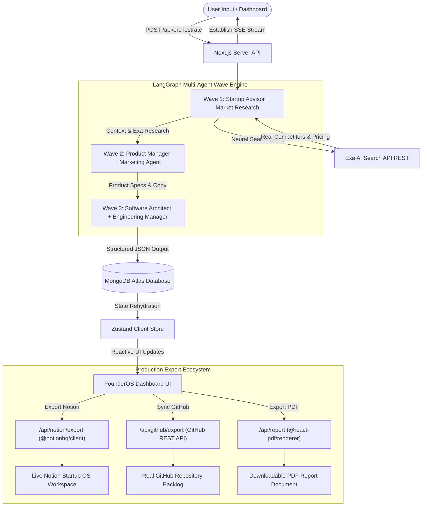

# 🎼 Founders Orchestra — Master Team Presentation & Technical Defense Guide

> **Official Team Presentation & Technical Defense Guide**  
> This comprehensive guide provides an exhaustive technical breakdown of the Founders Orchestra architecture, explaining each team member's specific subsystem, technical implementation details, exact line-by-line mechanics, presentation scripts, and defensive Q&A strategies.

---

## 📑 Table of Contents
1. [Executive Project Summary & Technical Stack](#1-executive-project-summary--technical-stack)
2. [End-to-End System Architecture (Mermaid)](#2-end-to-end-system-architecture)
3. [Agent Execution & Wave Dependency Flow (Mermaid)](#3-agent-execution--wave-dependency-flow)
4. [Member Breakdown 1: Soham Pansare (Project Lead & Integrations Manager)](#4-member-breakdown-1-soham-pansare-project-lead--integrations-manager)
5. [Member Breakdown 2: Janhavi — Agent & Prompt Engineering Lead](#5-member-breakdown-2-janhavi--agent--prompt-engineering-lead)
6. [Member Breakdown 3: Ishika — Backend & Data Engineering Lead](#6-member-breakdown-3-ishika--backend--data-engineering-lead)
7. [Member Breakdown 4: Shrutika — Frontend & UI/UX Engineering Lead](#7-member-breakdown-4-shrutika--frontend--uiux-engineering-lead)
8. [Master 5-Minute Presentation Script & Timing](#8-master-5-minute-presentation-script--timing)
9. [Comprehensive Technical Defense & Judge Q&A Matrix](#9-comprehensive-technical-defense--judge-qa-matrix)

---

## 1. Executive Project Summary & Technical Stack

**Founders Orchestra** is an AI-powered multi-agent startup orchestration platform built with Next.js 16, LangChain/LangGraph, and Groq/Llama-3.3-70b. It converts a single startup idea input into a complete, validated execution bundle in under 60 seconds.

Unlike single-prompt wrappers that produce superficial text summaries, Founders Orchestra orchestrates **6 specialized AI agents** executing in 3 sequential waves. The engine generates quantitative TAM/SAM/SOM market sizing, real competitor feature benchmarking (retrieved live via neural web search), Product Requirement Documents (PRDs), high-converting marketing launch kits, relational 4-6 table SQL database schemas, and actionable 3-phase engineering sprint roadmaps.

### 🛠️ Core Technology Stack
* **Core Framework**: Next.js 16 (React 19, App Router, TypeScript)
* **AI Orchestration**: LangChain (`@langchain/core`, `@langchain/groq`), LangGraph JS (`@langchain/langgraph`), Groq API (`llama-3.3-70b-versatile`)
* **Live Neural Search**: Exa AI Search API (Direct HTTP REST Integration via native `fetch`)
* **Streaming & Communication**: Server-Sent Events (SSE) via Web Streams API (`text/event-stream`)
* **Database & Persistence**: MongoDB Atlas, Mongoose ODM with serverless connection caching
* **Client State Management**: Zustand with persistent local storage re-hydration
* **Styling & Design System**: Tailwind CSS v4, FounderOS HSL tokens, glassmorphism, Lucide icons
* **Animations & Visualization**: Framer Motion, Recharts data visualization library
* **Export Ecosystem**: `@notionhq/client` SDK (Notion Workspace OS), GitHub REST API (Issue Syncing), `@react-pdf/renderer` (PDF Compilation)

---

## 2. End-to-End System Architecture

---

## 3. Agent Execution & Wave Dependency Flow

```mermaid
sequenceDiagram
    autonumber
    actor User as Founder
    participant Client as Client Store (Zustand)
    participant Server as Next.js SSE Endpoint
    participant Orchestrator as LangGraph Orchestrator
    participant Exa as Exa Neural Search
    participant LLM as Groq (Llama-3.3-70b)
    participant Mongo as MongoDB Atlas

    User->>Client: Enters Startup Idea & Click "Run All"
    Client->>Server: POST /api/orchestrate { input, targetAgents }
    Server-->>Client: 200 OK (Content-Type: text/event-stream)
    
    rect rgb(15, 23, 42)
        note right of Server: WAVE 1 (Parallel Execution)
        Server->>Orchestrator: Execute Startup Advisor & Market Research
        Orchestrator->>Exa: Live REST Query: "competitors pricing for [idea]"
        Exa-->>Orchestrator: Real Commercial Competitors & Pricing Highlights
        Orchestrator->>LLM: Evaluate PMF Score & Format TAM Monetary Valuations
        LLM-->>Orchestrator: AdvisorOutput & MarketOutput JSON
        Server-->>Client: SSE Event: agent-complete (Wave 1)
    end
    
    rect rgb(30, 27, 75)
        note right of Server: WAVE 2 (Parallel Execution)
        Server->>Orchestrator: Execute Product Manager & Marketing Agent
        Orchestrator->>LLM: Generate PRD, User Stories & Marketing Launch Copy
        LLM-->>Orchestrator: ProductOutput & MarketingOutput JSON
        Server-->>Client: SSE Event: agent-complete (Wave 2)
    end

    rect rgb(24, 43, 49)
        note right of Server: WAVE 3 (Parallel Execution)
        Server->>Orchestrator: Execute Architect & Engineering Manager
        Orchestrator->>LLM: Design 4-6 Table SQL Schema & Dynamic 3-Phase Sprint
        LLM-->>Orchestrator: ArchitectOutput & EngineeringOutput JSON
        Server-->>Client: SSE Event: agent-complete (Wave 3)
    end

    Server->>Mongo: Save Complete Project Payload to Database
    Server-->>Client: SSE Event: orchestration-complete
    Client->>User: Reactive Render of All 13+ Dashboard Components
```

---

## 4. Member Breakdown 1: Soham Pansare (Project Lead & Integrations Manager)

### 🎯 Role & Scope
* **Core Responsibilities**: Overall system design, boilerplate architecture, project management, technical coordination, and engineering the **3 External Export Integrations** (Notion Workspace OS, GitHub REST API Sync, PDF Report Generation).

### 🛠️ Detailed Technical Mechanics (Under the Hood)

#### A. Notion Startup OS Deployment (`app/api/notion/export/route.ts`)
* **SDK & Protocol**: Built using the official `@notionhq/client` package authenticated via Notion Integration Secret Tokens (`secret_...`).
* **ID Normalization (`extractPageId`)**: Uses regex `/([a-f0-9]{32})/i` or `/([a-f0-9-]{36})/i` to clean full Notion URLs or raw UUID strings into standardized 32-character hex strings.
* **Parent Page Creation**: Creates a root workspace page titled `🚀 [Startup Name] — Live AI Operating System` under the user's selected Notion parent page.
* **Header Callouts**: Appends a styled purple callout block summarizing PMF Signal (`/100`), TAM Valuation, Risk Level, and Advisor Briefing.
* **5 Structured Child Sub-Pages Deployment**: To keep workspace organization clean and prevent schema errors, the route deploys 5 child sub-pages under the root parent page, using native Notion table blocks and formatting:
  * **Competitor Intelligence Matrix Sub-Page**: Native Notion table block with columns for `Company`, `AI Capability`, `Personalization`, `Pricing/mo`, and `Threat Level`.
  * **Sprint Execution Roadmap Sub-Page**: Native Notion table block with columns for `Task Description`, `Milestone Phase`, `Priority`, and `Story Points`.
  * **Product Blueprint & PRD Sub-Page**: Formatted vision statement and structured user story bullet items with priority tags.
  * **Marketing Launch Kit Sub-Page**: Callout blocks featuring landing page copy, headlines, and LinkedIn launch posts.
  * **Database System Architecture Sub-Page**: Syntax-highlighted SQL code block rendering table definitions with primary and foreign keys.

#### B. GitHub REST API Sync (`app/api/github/export/route.ts`)
* **Endpoint Validation**: Authenticates via GitHub Personal Access Token (PAT) with `repo` scope against `https://api.github.com/repos/{owner}/{repo}` with custom headers (`X-GitHub-Api-Version: 2022-11-28`).
* **Client Validation Guard (`components/dashboard/github-export-modal.tsx`)**: The frontend modal strictly disables the submit button (`disabled={isExporting || !isFormValid}`) until token format (`ghp_` or `github_pat_` prefix), repo owner, and repo name are all valid.
* **Sequential Publishing**: Iterates through generated backlog issues with a 250ms delay between API calls to strictly comply with GitHub secondary rate limits.
* **Rich Body & Labeling**: Automatically formats Markdown issue bodies with epic tags, story points, and attaches auto-generated labels (`priority:P1`, `backend`, `frontend`).

#### C. PDF Report Compilation (`lib/pdf/report-template.tsx` & `app/api/report/route.ts`)
* **Engine**: Built using `@react-pdf/renderer` executing on the server to convert JSON agent outputs into binary PDF buffers (`renderToBuffer`).
* **Dynamic Content Layout**: Features dynamic cover pages, executive summary callouts, competitor benchmarking tables, SQL schema columns, and full 3-phase Sprint Execution Roadmaps with day range headers (`Sprint Days 1 – 4`).

### 📢 How to Present Your Role (Word-for-Word Script)
> *"As Project Lead, my primary objective was setting up our technical architecture and building an external export ecosystem that turns abstract AI analysis into actionable software assets.*
> *While AI outputs are useful, founders need real tools to execute. I engineered three production-grade export pipelines:*
> *First, our **Notion SDK Export** deploys a live Notion Startup Operating System workspace complete with 5 structured child sub-pages and native table blocks for competitor matrices and sprint roadmaps.*
> *Second, our **GitHub REST API Sync** publishes our engineering backlog directly to real GitHub repositories with priority tags and story points, featuring strict input validation guards.*
> *Third, our **PDF Generator** compiles our entire multi-agent analysis into a publication-ready document using React-PDF. I also ensured full cross-team architectural synchronization."*

---

## 5. Member Breakdown 2: Janhavi — Agent & Prompt Engineering Lead

### 🎯 Role & Scope
* **Core Responsibilities**: Engineering the **6 Specialized AI Agents**, system prompt design, LangGraph multi-wave pipeline orchestration, Zod schema validation, and Exa Neural Search integration.

### 🛠️ Detailed Technical Mechanics (Under the Hood)

#### A. 6 Specialized Agents Breakdown (`lib/agents/config.ts`)
1. **Startup Advisor**: Validates problem-solution fit, moat, and risk factors. Constrained to output an integer `pmf_score.score` between 0-100 and formatted numeric TAM monetary strings (e.g., `"$42B"`).
2. **Market Research**: Operates with live Exa neural search tools (`tools: ["search"]`). Extracts 3 to 5 real commercial competitors, pricing tiers, and assigns numeric scores (0-100) for `ai_capability` and `personalization`.
3. **Product Manager**: Constructs product vision, user stories with priority rankings (`high`, `medium`, `low`), and 3-phase release roadmaps (`MVP`, `Growth`, `Scale`).
4. **Software Architect**: Designs enterprise-grade 4 to 6 table relational SQL schemas (`users`, `workspaces`, domain entities, `billing`) complete with UUID data types, primary keys (`is_pk: true`), and foreign key linkages (`is_fk: true`).
5. **Engineering Manager**: Plans 2-week technical sprints (14 days), generates 6-8 actionable GitHub issues with story points, and structures the sprint into **EXACTLY THREE sequential engineering phases** of equal duration with dynamically invented technical phase names.
6. **Marketing Agent**: Generates high-converting landing page headlines, subheadlines, LinkedIn launch drafts, and email subject line angles.

#### B. Wave Orchestration & Structured Output (`lib/agents/schemas.ts` & `base-agent.ts`)
* **LangChain Structured Output**: Employs `.withStructuredOutput(schema)` backed by Zod schemas to guarantee 100% compliant JSON responses directly from Groq (`llama-3.3-70b-versatile`) without regex parsing hacks.
* **Exa Neural Search Integration (`lib/agents/base-agent.ts`)**: In `runAgentWithTools`, the system executes live HTTPS REST queries to `https://api.exa.ai/search` (`"competitors and pricing for [idea]"`), returning real live web citations and commercial pricing models which are injected directly into the prompt context prior to structured extraction.
* **API Key Round-Robin Rotation**: Implements dynamic round-robin key rotation across `GROQ_API_KEY_*` environment variables to distribute API rate limits seamlessly across execution runs.

### 📢 How to Present Your Role (Word-for-Word Script)
> *"I designed and orchestrated the core AI intelligence engine powering Founders Orchestra. Instead of relying on a single generic prompt, I engineered 6 domain-specific AI agents operating in 3 sequential waves.*
> *In Wave 1, our Market Research agent executes live neural web searches using the Exa AI API to extract real commercial competitors and actual pricing. In Wave 2, our Product Manager builds user stories based on market gaps. In Wave 3, our Architect designs production 4 to 6 table SQL relational schemas while our Engineering Manager generates technical backlog tasks divided into 3 dynamic phases.*
> *By enforcing strict Zod schemas and prompt constraints—such as requiring integer PMF scores and formatted monetary TAM values—I eliminated AI hallucinations and guaranteed structured data precision."*

---

## 6. Member Breakdown 3: Ishika — Backend & Data Engineering Lead

### 🎯 Role & Scope
* **Core Responsibilities**: Next.js App Router server architecture, MongoDB Atlas connection management, Mongoose data models, Server-Sent Events (SSE) streaming engine, and API security validation.

### 🛠️ Detailed Technical Mechanics (Under the Hood)

#### A. Server-Sent Events (SSE) Real-Time Streaming (`app/api/orchestrate/route.ts`)
* **Streaming Protocol**: Implements HTTP SSE using the native Web Streams API (`ReadableStream`). Sets HTTP headers (`Content-Type: text/event-stream`, `Cache-Control: no-cache`, `Connection: keep-alive`).
* **Progress Push Protocol**: As the multi-agent orchestrator executes each wave, the server immediately pushes JSON SSE events (`project-created`, `agent-start`, `agent-progress`, `agent-complete`, `agent-error`, `orchestration-complete`) to the client, providing zero-latency progress feedback without continuous polling.

#### B. Database Persistence & Connection Caching (`lib/db/mongodb.ts` & `lib/db/models/project.ts`)
* **Serverless Connection Caching**: Implements a global connection cache (`global.mongoose`) in `mongodb.ts` to prevent MongoDB connection pooling exhaustion during hot-reloads and Vercel serverless function invocations.
* **Mongoose Project Schema**: Models full project states, storing user inputs, overall status (`not-started`, `in-progress`, `completed`, `partial`, `error`), and complete agent output JSON payloads for historical re-hydration.

#### C. API Validation & Route Handlers (`lib/validations/*`)
* Utilizes Zod schemas (`orchestrateRequestSchema`, `reportRequestSchema`) to validate incoming API request bodies, sanitizing input parameters, enforcing IP rate limiting (`5 req/min`), and protecting against malformed payloads.

### 📢 How to Present Your Role (Word-for-Word Script)
> *"I engineered the backend server architecture and data infrastructure supporting Founders Orchestra. Because running 6 complex AI agents sequentially takes time, delivering a smooth user experience was critical. I implemented Server-Sent Events (SSE) real-time streaming.*
> *This allows our Next.js backend to stream agent progress events directly to the browser as each agent finishes executing, eliminating client polling.*
> *For data persistence, I designed our MongoDB Atlas schema modeling with Mongoose, implementing connection caching optimized for serverless environments. This enables founders to save, load, and re-hydrate past analysis runs instantly."*

---

## 7. Member Breakdown 4: Shrutika — Frontend & UI/UX Engineering Lead

### 🎯 Role & Scope
* **Core Responsibilities**: FounderOS dark-mode design system, 13+ responsive dashboard component layouts, interactive Recharts charts, Framer Motion micro-animations, and Zustand state management.

### 🛠️ Detailed Technical Mechanics (Under the Hood)

#### A. FounderOS Design System & Dashboard Components (`components/dashboard/*`)
* **Always-Dark Design Tokens**: Built custom CSS variables using curated HSL color palettes (`--color-fo-bg`, `--color-fo-surface`, `--color-fo-sky`, `--color-fo-purple`) with glassmorphism borders and glowing badges.
* **13+ Specialized Cards**: Developed components including `AgentOrbit` (SVG donut ring with pulsing central core), `StatsRow` (with score scale guards for PMF and TAM sanitization), `MarketSizing` (vertical bar chart rendering via Recharts), `CompetitorTable` (capability scores & threat badges), `GithubIssues`, and `SprintBoard` (rendering 3 dynamic AI-named technical phases with uniform duration headers like `Sprint Days 1 – 4`).
* **Synchronized Sidebar Navigation (`components/dashboard/sidebar.tsx`)**: Reordered navigation items to strictly match the 1-to-1 vertical reading order of the dashboard sections.

#### B. Micro-Animations & Expandable Dropdowns (`components/ui/expandable-text.tsx`)
* **Framer Motion Integration**: Created reusable `ExpandableText` dropdown components (`View full analysis ▼`) across analysis cards, enabling smooth animated expansion of lengthy AI reasoning while keeping the primary dashboard clean.

#### C. Client State Management (`lib/store/project-store.ts`)
* Powered by Zustand, managing active sections, pipeline execution triggers (`runOrchestration`), SSE stream listener handling, and project state re-hydration.

### 📢 How to Present Your Role (Word-for-Word Script)
> *"I designed and developed the frontend architecture and user interface for Founders Orchestra. Our vision was to create a state-of-the-art dashboard that provides a stunning first impression.*
> *I built our FounderOS design system featuring dark-mode glassmorphism cards and curated HSL color tokens. I developed 13+ reusable dashboard components, including interactive Recharts bar charts for market sizing and dynamic sprint execution boards.*
> *To maintain high information density without cluttering the UI, I created expandable text dropdowns powered by Framer Motion smooth micro-animations. I also implemented full mobile responsiveness and state management via Zustand."*

---

## 8. Master 5-Minute Presentation Script & Timing

| Time | Speaker | Topic & Speech Script | On-Screen Visual Action |
|---|---|---|---|
| **0:00 - 0:45** | **Soham Pansare (Project Lead)** | *"Hello judges and professors. Today we present **Founders Orchestra**, an AI-powered multi-agent platform that turns a single startup idea into a production execution bundle in under 60 seconds."* | Show Landing Page, enter startup idea into input field, click "Generate Workspace". |
| **0:45 - 1:45** | **Janhavi** | *"Under the hood, 6 specialized AI agents execute across 3 sequential waves. In Wave 1, our Market Research agent queries Exa AI for live web neural search data to extract real competitors and pricing..."* | Highlight Agent Orbit SVG animation as Wave 1 and Wave 2 status nodes pulse and turn green. |
| **1:45 - 2:45** | **Ishika** | *"To deliver real-time feedback, our Next.js server streams agent execution events directly to the browser using Server-Sent Events (SSE), persisting complete agent outputs to MongoDB Atlas..."* | Scroll down dashboard demonstrating real-time rendering of Market Sizing bar charts and Competitor tables. |
| **2:45 - 3:45** | **Shrutika** | *"For the frontend, I developed our FounderOS design system using glassmorphism cards, Recharts visualizations, and Framer Motion animated dropdowns to explore deep AI reasoning..."* | Click "View full analysis ▼" on analysis cards and demonstrate scrolling through the 3-Phase Sprint Roadmap. |
| **3:45 - 4:45** | **Soham Pansare (Project Lead)** | *"Finally, Founders Orchestra empowers founders to export their intelligence into real tools. I built our GitHub REST API sync to publish real issues, our Notion SDK export to deploy a live workspace, and PDF compilation."* | Click "Sync to GitHub" and "Export Notion" buttons, showing input validation guards and live export modals. |
| **4:45 - 5:00** | **All Team** | *"Thank you! We are now open for any technical questions."* | Display Q&A slide / Active Dashboard. |

---

## 9. Comprehensive Technical Defense & Judge Q&A Matrix

This exhaustive Q&A matrix prepares all team members for technical questioning by judges, investors, or professors. Questions are structured across **Easy**, **Medium**, and **Hard** difficulty tiers.

---

### 🟢 EASY LEVEL QUESTIONS (Fundamentals & Surface Concepts)

#### Q1: "What exact problem does Founders Orchestra solve for an early-stage startup founder?"
* **Speaker**: **Soham Pansare (Project Lead)**
* **Answer**: *"Founders Orchestra eliminates the fragmented, manual process of early startup creation. Usually, a founder has to manually write PRDs in Google Docs, research competitors on Google, design database schemas, and manually write Jira tickets. Our multi-agent pipeline automates all of this in under 60 seconds, outputting validated market sizing, user stories, architecture blueprints, and exporting them directly into Notion, GitHub, and PDF."*

#### Q2: "Which LLM model powers your AI agents, and why did you select it?"
* **Speaker**: **Janhavi (Agent Lead)**
* **Answer**: *"We use Groq's host of `llama-3.3-70b-versatile`. We selected Llama 3.3 70B via Groq because Groq's LPU (Language Processing Unit) hardware delivers ultra-fast inference speeds (over 300 tokens per second), enabling our 6 complex agents to run sequentially without causing long timeout delays for the user."*

#### Q3: "What happens if a user wants to test the application without entering API keys or waiting for live runs?"
* **Speaker**: **Shrutika (Frontend Lead)**
* **Answer**: *"We built an instant 'Load Demo' feature powered by pre-compiled mock project state (`lib/mock-data.ts`). Clicking 'Load Demo' immediately hydrates our Zustand client store with complete multi-agent outputs, rendering all 13+ dashboard components instantly without making external network calls."*

#### Q4: "What is the purpose of dividing agent execution into 3 Waves?"
* **Speaker**: **Janhavi (Agent Lead)**
* **Answer**: *"Wave execution respects strict logical dependency. Wave 1 gathers market research and validates the idea. Wave 2 uses that research to write product user stories and marketing copy. Wave 3 takes the product specifications to design technical database schemas and engineering sprint tasks. Running independent agents in parallel within each wave optimizes overall execution speed."*

#### Q5: "How do founders export their generated startup artifacts out of the app?"
* **Speaker**: **Soham Pansare (Project Lead)**
* **Answer**: *"We engineered three production export pipelines accessible from our topbar and dashboard components: an automated Notion SDK deployment to build a live Notion workspace, a GitHub REST API sync to publish backlog issues, and a server-side PDF generator powered by `@react-pdf/renderer`."*

---

### 🟡 MEDIUM LEVEL QUESTIONS (Architectural Mechanics & Data Flow)

#### Q6: "How do you handle Groq API rate limits when multiple users execute pipelines simultaneously?"
* **Speaker**: **Janhavi (Agent Lead)**
* **Answer**: *"We engineered an automated API Key Round-Robin Rotation mechanism. The backend dynamically rotates requests across multiple `GROQ_API_KEY_*` environment variables. Furthermore, by distributing execution across 3 waves and caching structured outputs, we stay comfortably within API rate limits."*

#### Q7: "Why did you choose Server-Sent Events (SSE) instead of WebSockets or HTTP Polling?"
* **Speaker**: **Ishika (Backend Lead)**
* **Answer**: *"SSE operates natively over HTTP/2 using standard browser Web Streams (`text/event-stream`). It is lightweight, firewall-friendly, and unidirectional—perfect for server-to-client streaming during AI wave execution. It avoids the continuous network overhead of HTTP polling and the stateful connection complexity of WebSockets."*

#### Q8: "How does your GitHub REST API export enforce validation and handle secondary rate limits?"
* **Speaker**: **Soham Pansare (Project Lead)**
* **Answer**: *"On the client side, our modal strictly disables the submit button until the PAT format (`ghp_` or `github_pat_` prefix), owner, and repo fields are valid. On the server side (`/api/github/export`), we validate repo access via GitHub's API and execute issue creation sequentially with a 250ms delay buffer between calls to strictly respect GitHub's secondary rate limits."*

#### Q9: "Why did you choose native Notion page blocks over raw Notion database creation endpoints?"
* **Speaker**: **Soham Pansare (Project Lead)**
* **Answer**: *"The Notion API's database creation endpoints (`databases.create`) enforce rigid property schema validations that frequently reject custom property fields or fail across different workspace permissions. By deploying native Notion page blocks (`table`, `table_row`, `callout`, `code`) across 5 structured child sub-pages, we guarantee 100% reliable deployment on any Notion account."*

#### Q10: "How does Zustand manage state re-hydration when switching between live runs and historical runs?"
* **Speaker**: **Shrutika (Frontend Lead)**
* **Answer**: *"Zustand acts as our centralized client store (`project-store.ts`). When a user selects a past run from the History page or runs a live orchestration, Zustand updates the global state object. Because all 13+ dashboard components subscribe to atomic selectors in Zustand, the entire dashboard re-renders reactively with zero full-page reloads."*

#### Q11: "How do you ensure TAM values are always formatted monetary figures rather than vague text?"
* **Speaker**: **Janhavi (Agent Lead)**
* **Answer**: *"We enforce strict system prompt constraints explicitly forbidding qualitative words like 'large' or 'huge', requiring formatted strings like '$42B'. Additionally, Shrutika built a defensive frontend regex filter in `stats-row.tsx` that catches non-numeric qualitative strings and falls back to quantitative market research values."*

#### Q12: "How is serverless database connection pooling managed with MongoDB Atlas and Mongoose?"
* **Speaker**: **Ishika (Backend Lead)**
* **Answer**: *"In serverless environments like Vercel, every API call can spin up a new container, causing connection exhaustion. In `lib/db/mongodb.ts`, we implement a global caching pattern (`global.mongoose`). If a connection promise already exists in the global object, Mongoose reuses it instead of creating a new connection pool."*

---

### 🔴 HARD LEVEL QUESTIONS (Deep Engineering, Edge Cases & Scaling)

#### Q13: "How do you guarantee zero context pollution or hallucinations between dependent agent waves?"
* **Speaker**: **Janhavi (Agent Lead)**
* **Answer**: *"Instead of passing an unconstrained raw chat log between waves, we enforce Zod schema validation using LangChain's `.withStructuredOutput()`. When Wave 2 executes, it receives only clean, validated JSON objects from Wave 1. This structured context isolation eliminates hallucinated assumptions and prevents prompt drift."*

#### Q14: "What happens if an agent fails mid-way through Wave 2? How does the system handle error state persistence?"
* **Speaker**: **Ishika (Backend Lead)**
* **Answer**: *"Our backend orchestrator (`/api/orchestrate`) wraps each agent execution in a try-catch block. If an agent fails, the server streams an `agent-error` SSE event to the client so the UI marks that specific agent card with a warning badge. The server updates the MongoDB project document status to `partial` or `error`, saving all successfully completed agent outputs so user progress is never lost."*

#### Q15: "How does your Exa AI REST integration extract live competitor pricing without breaking structured JSON output?"
* **Speaker**: **Janhavi (Agent Lead)**
* **Answer**: *"In `base-agent.ts`, our `runAgentWithTools` function executes a direct HTTPS REST POST request to `https://api.exa.ai/search`. It sends a targeted query like `'competitors and pricing for [idea]'`. The top live web snippet results are injected directly into the LLM prompt context prior to structured output parsing, allowing Llama 3.3 to extract clean pricing tiers into our Zod schema."*

#### Q16: "If 10,000 founders run orchestrations simultaneously, what are your primary scaling bottlenecks and solutions?"
* **Speaker**: **Ishika (Backend Lead)**
* **Answer**: *"The primary bottleneck would be LLM rate limits and serverless execution timeouts. To scale to 10,000 concurrent runs, we would decouple the orchestrator using an asynchronous message queue like Redis/BullMQ or AWS SQS. Instead of holding open HTTP SSE connections on Vercel, background worker nodes would process agent waves asynchronously and push real-time updates via WebSockets or WebHooks."*

#### Q17: "How do you handle security and credential storage for user-provided GitHub PATs and Notion Tokens?"
* **Speaker**: **Soham Pansare (Project Lead)**
* **Answer**: *"We prioritize a zero-trust, privacy-first architecture. User tokens (`ghp_...`, `secret_...`) are entered inside client-side modal dialogs and cached exclusively in the user's browser `localStorage`. When an export action occurs, credentials are transmitted over SSL/TLS directly to our API endpoint for standard HTTP header authentication and are never persisted in our database."*

#### Q18: "How does the Engineering Manager agent invent dynamic technical phase names for the sprint plan?"
* **Speaker**: **Janhavi (Agent Lead)**
* **Answer**: *"In `config.ts`, our system prompt instructs the Engineering Manager agent to structure the 2-week sprint into exactly 3 sequential phases of equal duration and dynamically invent domain-specific technical names (e.g., 'Architecture & DB Setup', 'Core APIs & Engine Build', 'CI/CD & Integration'). On the frontend, Shrutika's `SprintBoard` component standardizes the duration headers to 'Sprint Days 1 – 4', '5 – 9', and '10 – 14'."*

#### Q19: "Why did you choose Next.js App Router and TypeScript over a separated React SPA + Express architecture?"
* **Speaker**: **Soham Pansare (Project Lead)**
* **Answer**: *"Next.js App Router provides a unified full-stack architecture. Server Components and API Route Handlers allow us to keep heavy LLM orchestrations and API secrets securely on the server while delivering instant SSR page loads. TypeScript provides end-to-end type safety between our Zod agent schemas, MongoDB models, and frontend Zustand store."*

#### Q20: "How do you handle browser hydration mismatches between server-side rendered HTML and client-side Zustand state?"
* **Speaker**: **Shrutika (Frontend Lead)**
* **Answer**: *"Hydration errors occur when server HTML differs from client state. To prevent this, our Zustand store uses a mounting check (`hasHydrated` flag or `useEffect` mount guard) before rendering state-dependent components like topbar user inputs or historical run drawers. We also added explicit locks against browser extensions like Dark Reader injecting unauthorized DOM nodes."*

